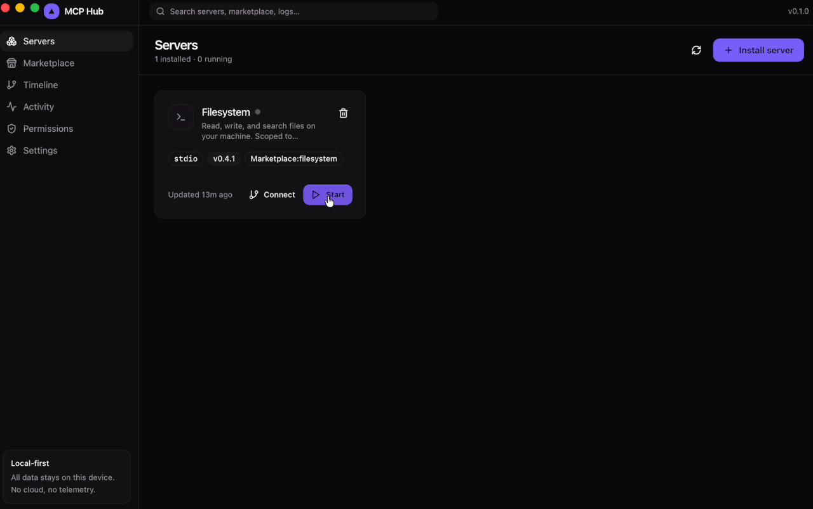

# MCP Hub

[](https://github.com/Dembayev/MCP-HUB/actions/workflows/ci.yml)  

> **Docker Desktop for MCP servers and AI agents.** Local-first, secure, and beautiful.

> ⚠️ **Pre-alpha — building in public.** The core architecture is in place but the app is not yet installable. Star the repo to watch progress toward v0.1 alpha. Issues / bug reports are not yet useful — open a [Discussion](../../discussions) instead.

<p align="center">
  
</p>
<p align="center">
  <sub><strong>See</strong> every action your AI agents take. <strong>Replay</strong> it. <strong>Approve</strong> what they're allowed to do.</sub>
</p>

MCP Hub is an open-source desktop app that turns the chaotic world of [Model Context Protocol](https://modelcontextprotocol.io/) servers into a one-click experience. Install servers from a marketplace, run them in isolated processes, review what they can access, and watch them work — all from a single window. No cloud, no telemetry, no Electron.

<p align="center">
  <em>Built with Tauri 2 · Rust · React · TypeScript · Tailwind · shadcn/ui</em>
</p>

---

## Why this exists

The MCP ecosystem is growing fast, but the developer experience is rough:

- Setting up a single server means hand-editing JSON configs across multiple clients.
- There's no shared GUI to start, stop, or inspect what's running.
- Permissions are implicit — a server you install can read anything your shell can.
- Discovery is "Google a GitHub repo and hope for a README."
- There's no trust layer.

MCP Hub closes all of these in one place: a fast, beautiful, local-first desktop app that treats MCP servers the way Docker Desktop treats containers.

## What's inside the MVP

- **One-click install** of MCP servers from a curated marketplace
- **Process supervision** — start, stop, restart, view status at a glance
- **Permissions panel** — see and revoke filesystem, network, and exec access per server
- **Live activity & logs** — tail stdout/stderr in real time
- **Local-first storage** — SQLite, encrypted-at-rest, never leaves your machine
- **Sandbox abstraction** — pluggable runner (raw process today; sandbox-exec / job objects / containers next)

## Tech stack

| Layer       | Choice                                                  | Why                                                  |
| ----------- | ------------------------------------------------------- | ---------------------------------------------------- |
| Shell       | [Tauri 2](https://tauri.app)                            | Native binary, ~10MB, no Chromium bundled            |
| Backend     | Rust (`tokio`, `rusqlite`, `parking_lot`)               | Fast, safe, single binary                            |
| Frontend    | React 18 + TypeScript (strict) + Vite                   | Industry-default DX, instant HMR                     |
| Styling     | Tailwind CSS + shadcn/ui (new-york)                     | Design-system primitives without the runtime cost    |
| Animation   | Framer Motion                                           | Polished micro-interactions where they matter        |
| Persistence | SQLite (bundled, WAL mode)                              | Zero-config local store                              |

## Project layout

```
mcp-hub/
├── src/                      # React frontend
│   ├── components/
│   │   ├── ui/               # shadcn primitives (button, card, badge, input)
│   │   ├── layout/           # app shell, sidebar, titlebar
│   │   └── servers/          # server card, list, empty state, status dot
│   ├── hooks/                # useMcpServers — talks to Tauri or mocks
│   ├── lib/                  # tauri.ts (typed invoke), utils
│   ├── pages/                # one file per route
│   └── types/                # IPC payload types (mirror Rust models)
├── src-tauri/                # Rust backend
│   ├── src/
│   │   ├── commands/         # Tauri commands — thin IPC surface
│   │   ├── db/               # SQLite + migrations + row models
│   │   ├── mcp/              # registry + process manager
│   │   ├── security/         # permissions model + sandbox trait
│   │   ├── error.rs          # AppError + Serialize impl for IPC
│   │   ├── state.rs          # shared AppState
│   │   └── lib.rs            # wiring + tauri::Builder
│   ├── capabilities/         # Tauri 2 permission capabilities
│   ├── icons/                # platform icons
│   └── tauri.conf.json
└── package.json
```

## Getting started

Requirements: **Rust 1.77+**, **Node.js 18+**, and the [Tauri prerequisites](https://tauri.app/v2/guides/getting-started/prerequisites) for your OS.

```bash
# install JS dependencies
npm install

# run the desktop app in dev mode (recompiles Rust on change)
npm run tauri:dev

# build a production binary
npm run tauri:build
```

For frontend-only iteration (faster HMR, mock data — no Tauri shell needed):

```bash
npm run dev
```

`useMcpServers` automatically falls back to a mock dataset when not running inside Tauri, so designers can work on the UI without touching Rust.

## How it works

```
   AI client (Claude Desktop, Cursor, …)
                  │  stdio (MCP JSON-RPC)
                  ▼
       mcp-hub-proxy (tiny worker binary)
                  │  Unix domain socket
                  ▼
       MCP Hub  ┌──────────────────────────┐
                │  classify request        │
                │  enforce_permission ─────┼──► AskUser? → approval modal
                │  forward to MCP server   │                  ↓
                │  capture response        │              user decision
                │  emit Action to NDJSON   │                  │
                └──────────────────────────┘                  ▼
                  │  stdio                              session trace
                  ▼                                    on disk
            real MCP server
            (npx @mcp/server-filesystem, …)
```

Every classified `tools/call` flowing through the proxy becomes an `Action`
record in `<data_dir>/sessions/<id>.ndjson`. The Timeline tab tails that
stream; the Replay engine plays it back deterministically (no live state
required — pure reading of the disk record).

The three verbs of the product map directly onto three layers of the
runtime:

- **See** — proxy classifies + emits a session-trace `Action` per tool call.
- **Replay** — Timeline UI reads the NDJSON, sorts by `seq`, drives the
  scrubber over the trace.
- **Approve** — `enforce_permission` returns `Decision::AskUser` when a
  scope isn't granted; the proxy task awaits a `oneshot::Sender` registered
  in the in-memory approval registry, which the modal resolves.

For the wire format details see [`docs/SESSION_SCHEMA.md`](docs/SESSION_SCHEMA.md).
For internal architecture notes see [`CONTRIBUTING.md`](CONTRIBUTING.md).

## Use with an AI client

> ⚠️ Pre-alpha — verified end-to-end on macOS only.
> Integration with Claude Desktop / Cursor / Cline is being smoke-tested
> against real MCP servers; the exact config snippet is captured in
> `docs/USAGE.md` once the round-trip is validated. Watch the v0.1.0-alpha
> release notes for the unblocking commit.

## Roadmap

**Shipped — verified in tests**

- [x] Frozen v0.1.0 session NDJSON wire format ([spec](docs/SESSION_SCHEMA.md))
- [x] Append-only writer with batched fsync, truncation-tolerant reader
- [x] mpsc-based async runtime (no Mutex in hot path)
- [x] Causal-chain replay via `seq` ordering
- [x] Timeline UI — sidebar + dense action stream, DevTools/Chrome-trace style
- [x] Replay engine — scrubber, play/pause, step ±, speed (0.5×–10×, instant)
- [x] Runtime approval prompts — Allow Once / Always Allow / Deny + persistent grants
- [x] Per-server platform sandbox profiles (macOS `sandbox-exec`)
- [x] Proxy instrumentation — real MCP traffic captured into session traces

**Next — for v0.1.0 alpha**

- [ ] End-to-end verified Claude Desktop integration path documented
- [ ] `mcp-hub tail` CLI — color-coded NDJSON stream for the terminal
- [ ] Live action append into Timeline without page refresh (file-watcher event)
- [ ] AppArmor / job-objects sandbox backends (Linux / Windows)

**Deferred — explicitly out of scope until post v0.1**

- [ ] Marketplace UI + curated registry feed
- [ ] Encrypted secrets vault for env vars
- [ ] OS-native auto-update
- [ ] Cloud sync, multi-user, trust-score / risk heuristics
  (see [`SECURITY.md`](SECURITY.md) for the threat model)

## Architecture notes

- **State management** lives in Rust, not React. The frontend is a view layer;
  all writes go through Tauri commands so the source of truth is one place.
- **Errors are stringified at the IPC boundary.** `AppError` implements
  `Serialize` as its `Display` form, so the frontend gets clean messages
  without leaking enum internals.
- **The sandbox is a trait.** `sandbox-exec` ships today on macOS;
  platform-specific implementations (AppArmor on Linux, job objects on
  Windows) plug in behind the same `Sandbox::prepare` signature without
  touching IPC or UI code.
- **The session writer is mpsc-task, not Mutex.** No shared lock in the hot
  path — producers send `Action` records through a channel, one writer task
  owns the file and drains serially. See `mcp_hub_launch_guardrails` and
  `docs/SESSION_SCHEMA.md` for the design rationale.
- **`seq` is logical order, disk is arrival order.** The reader sorts by
  `seq` per spec §3 so concurrent in-flight requests don't break replay.
- **No router.** Five top-level routes — a tiny `useState` beats pulling in
  `react-router`. We'll revisit if URL deep-linking matters.
- **Bundle stays lean.** No state library, no data-fetch lib. Tauri keeps
  the binary around 10 MB.

## Contributing

Issues and PRs welcome. See [CONTRIBUTING.md](./CONTRIBUTING.md) for the dev setup, code style, and how the modules fit together.

## License

[MIT](./LICENSE)
